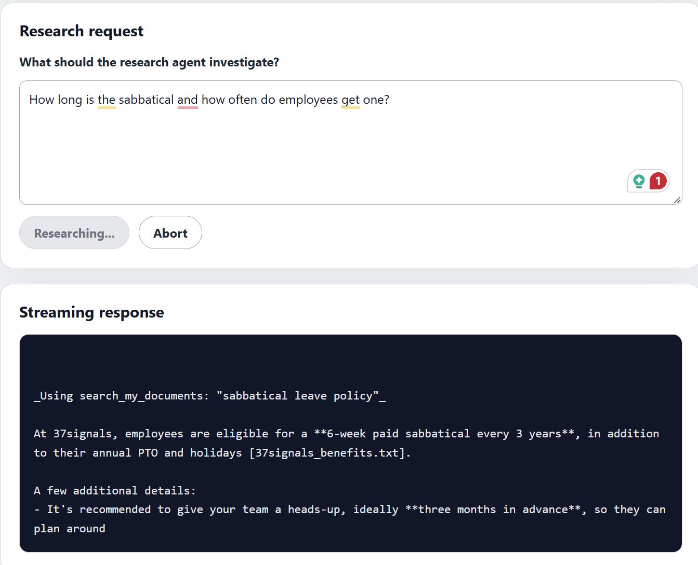
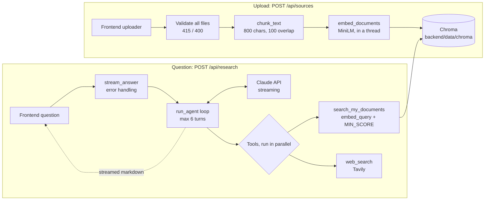

# Research Agent (Bowatt technical test)

A research agent is a tool where it can take source files and answer the questions/requests you want it to be answered. This repo is the backend for the provided React frontend. You upload text files, they are embedded and stored and then you can ask a question. The request does not have to be about the documents. For every request the Claude agent decides by itself whether to search your documents, the web or both. After  that the answer is streamed back as markdown with its sources.



## Setup and running

To run the program, you should make these things prepared:
[Python 3.12](https://www.python.org/downloads/), [Node 20+](https://nodejs.org/en/download), an [Anthropic key](https://platform.claude.com/settings/keys) and a [Tavily key](https://app.tavily.com/home).

After that you should be following these steps:

### Backend

1. Open up a terminal via your IDE, clone the repo and go into it:

   ```
   git clone https://github.com/OmerAlpSahin/bowatt-task.git
   cd bowatt-task
   ```
2. Create and activate a venv:

   ```
   python -m venv .venv
   ```

   - Windows: `.venv\Scripts\Activate.ps1`
   - macOS/Linux: `source .venv/bin/activate`
3. Install the packages:

   ```
   pip install -r backend/requirements.txt
   ```
4. Copy `backend/.env.example` to `backend/.env` and add the keys:

   - Windows: `copy backend\.env.example backend\.env`
   - macOS/Linux: `cp backend/.env.example backend/.env`
5. `cd backend` and start uvicorn (it has to be started from `backend/`):

   ```
   cd backend
   uvicorn main:app --reload --port 8787
   ```

### Frontend

Open a second terminal, because the backend keeps running in the first one.

1. Redirectory to frontend by `cd frontend`
2. Then by order `npm install` and `npm run dev`
3. Open http://localhost:5173

To try it, upload the files in `sample_docs/` (or your own text files) from the "Your sources" panel, then ask a question.

Note: the first start takes a bit longer than the next restarts because it downloads the embedding model.

Also, the current LLM model is `claude-haiku-4-5`. If you want to change it, you can find it as `LLM_MODEL` in `backend/.env` (the file that API keys should exist). `claude-haiku-4-5` is cheaper, `claude-sonnet-5` gives better answers.

## Architecture and design decisions

### Overview



(AI generated)

### Ingestion (uploads)

Collecting and loading the raw data came from the user. When the user uploads the source data, it basically have this flow: `POST /api/sources` → check → read → chunk → embed → store

* `rest/sources.py` is the endpoint
* `ingestion/chunking.py`, `embeddings.py`, `vector_store.py` each has one job
* `ingestion/pipeline.py` ties chunking, embeddings and vector_store together by`ingest_text` and `search_documents`

1 -  Validation
Every file the user uploads are checked before any of them are stored. Nothing is saved if any file is problematic or broken, so the user never have a half-saved upload. Different status codes are raised based on the exception:

* not `text/*` → 415
* not valid UTF-8 → 400
* empty or only spaces → 400

Also, the error messages name the file so that the user knows which file is the problem.
2  -  Chunking
I set it to 800 characters with 100 overlap. The reason for overlap is when a sentence is cut, it would still seen as a whole in the next chunk. The reason for 800 chars is the embedding model([all-MiniLM-L6-v2](https://huggingface.co/sentence-transformers/all-MiniLM-L6-v2)) only reads about 256 tokens and thats roughly 1000 chars. If I would select higher chars, then it would silently cut off. Due to the time limitations, I could not implement the split by paragraph or sentence boundaries. Currently it cuts by character count and if can end in the middle  of the word.

3 - Embeddings

I used a local model **`all-MiniLM-L6-v2`** (see .env EMBEDDING_MODEL) via `sentence-transformers`. Output dimension is 384 and it is normalized  so cosine similarity works simply. I used this model because it is free and it works offline. On a production version, a hosted model like Voyage is a good choice for a better quality. **`embed_documents`** and `embed_query` are seperated. Documents are embedded at upload time and the question at search time.

4  - Vector Store

I used Chroma to store and query vector embeddings because it runs locally without an external server. On a production version, pgvector or Qdrant would be a better idea for PostgreSQL  or high scale search. I used cosine distance(pretty standard). To be able to cite the file in the answers, each chunk is stored with metadata as filename and chunk number. Also this metadata and deleting the old chunks of the file before upserting are important to prevent stale chunks left behind when there is a reuploading a shorter version of a file.

5- Parallelism

Embedding runs in `asyncio.to_thread` because it keeps the CPU busy and it would freeze the whole server and affect the stream of other users. Also multiple files are processed at the same time  with **`asyncio.gather`**.

6 - Startup Warm-up

The model and database are created "once" at server start with FastAPI `lifespan`, before any request comes. It fixes the race condition (see Bugs I found along the way) and makes the first upload fast.

### The agent

When the user asks/requests something, this folow is triggered:`POST /api/research` → `stream_answer` → `run_agent` → Claude ⇄ tools → answer streamed back

* `agent/tools.py` contains tool definitions + implementations + `run_tool`
* `agent/agent.py` is the loop
* `rest/research.py` consists of the endpoint and error handling

1 - Two tools

- `search_my_documents`embeds the query and searches Chroma. The results with a score < 0.25(`MIN_SCORE`) are not kept. The reason for this threshold is that the search always returns the 5 closest chunks, even for unrelated questions. In my tests an unrelated question still got chunks with scores 0.14 and lower, while a real match scored about 0.53. This is basically a noise and this `MIN_SCORE` is a starting value that should be fine tuned with evaluation.
- `web_search`is done by Tavily(real time search engine for AI agents) with 5 results and each is cut to 1000 chars, because tool results are resent to Claude in every round of the loop and long pages get costly.

Also the tool descriptions are important because Claude chooses tools based only on the name and the description.

2 - The loop

I didnt use a framework like LangChain for the loop because I have the full control on this and its easier to explain and especially debug. It works basically like this:

* Call Claude with the question and tools → if it asks for tools and run them → send the results back → repeat until it answers without tools

The API has no memory so the whole converstaion is being send again every round. So, I set a cost guard by setting `MAX_TURNS = 6` to prevent infinite loops

3 - Parallel  tool calls

For some requests, claude asks for several tools at once like documents and web. In that case, they run together with `asyncio.gather`. All results go back in one message. If they would be splitted, it would make Claude stop calling tools in parallel.

4 - System prompt

It basically tells Claude:

* documents may exist, and it can't know what's in them without searching
* never claim there are no documents without searching
* use the web for current or general topics
* cite `[filename]` or `[title](url)`
* say "I dont know" rather than guess

5 - Tool errors are not raised, they are returned

If a  tool fails `run_tool` returns the error to Claude with `is_error`so Claude can adapt. Error is also logged with its full traceback.

6 - Model choice

`LLM_MODEL` in `.env`. Haiku 4.5 is used for development because it is cheap. Sonnet 5 is used for the examples because it gives better answers.

### Streaming, errors and cancellation

1-  Streaming

`messages.stream()` sends Claude's text piece by piece to the frontend and progress lines like "Using web_search" also shown so the user is not looking at a blank page.

The agent is a generator(yield) and plugs directly into `StreamingResponse`.

2 - Errors during the stream

The streaming sends  `200 OK`before any content so a later error can not change the status.

First I tested a wrong API key and the frontend only showed "network error". I fixed it by adding a `stream_answer` wrapper that catches Anthropic errors and it writes readable `**Error:**`s into the stream and details go to the log. The logs go to the terminal (standard output). In production they would be collected by the platform (for example Docker or a log service) instead of being written to files.

When there are errors happen before the streaming starts(for example an empty question), it gets proper 400 responses.

3 - Abort/Cancellation of the request

If the browser disconnects or the user clicks on "Abort" mid stream, Python raises `CancelledError` and `async with` closes the Claude connection so no more tokens are spent. This is also  logged and passed on(with `raise`) because if I only caught it without passing it on, Python would think the cancellation was handled and the request would keep running. However, a limitation is when a document search is running in a thread, it can not be cancelled. It finishes in the background and its result is thrown away.

### Bugs I found along the way

1 - Race condition when uploading several files:
When I uploaded two files at once into a fresh ChromaDB failed because the database and model were created lazily, only when they were first used. Two upload threads reached "create" at the same time and `lru_cache` does not stop two simultaneous first calls. I reproduced the error 5 out of 5 times before the fix. To fix it, I created both once at the server start with `lifespan` warmup.

2 - The query embedding used only the first letter

There was no error but the search quality was wrong. The same sentence embedded as a document and a s query scored 0.123 similarty instead of around 1.0. The reason was `embed_query` passed the first character (`text[0]`)instead of wrapping the text in a list. The fix was `embed_documents([text])[0]` and it was hard to find. I realized it with a test on the result rather than an error.

3-The safety net hid a real bug

The agent kep saying the document search had "a system error" because a comparison between a list and a number  raised a TypeError everytime but`run_tool` catches all errors and passes them to Claude. It was again a silent error  without a problem  shown in the terminal and I fixed it by applying correct filtering and `logger.exception` in `run_tool` so that every tool failure could be traced back with its logs. It showed me the importance of the log again because user is protected with the error on the page but developer should be informed as well.

4 - The agent answered without searching

When I asked  a question, the agent answered "I dont have any documents uploaded" without calling `search_my_documents`. The reason was the system prompt "for anything that may be covered by the uploaded files" but Claude can not know what is covered without searching, so it hallucinated and guessed. The fix was on the prompt and now it is wrapped around "documents may exist, their contents are unknown until searched and never claim there are no docs without searching". It showed me the importance of the prompt because it is often the reason of agent bugs, not the code. This is why tool selection accuracy belngs in the evaluation.

### What I'd do with more time

* **Boundary-aware chunking:**  I would split at paragraphs or sentences instead of every 800 characters so chunks do not end middle of the word and search results are cleaner
* **An upload queue**: Right now the upload request waits until embedding is finished. With a queue, the endpoint would reply immediately and a background worker would embed the files with the frontend checking progress. This matters for large files or many users so it is definitely a must in production
* **Tests for the agent loop:** Currently the tools and endpoints are tested but the loop itself is not because that needs a fake Claude that streams responses. With that I could test a case like when Claude asks for two tools and they both run in parallel and at the end the results sent back correctly or not.
* **Hybrid search:** I would combine vector search(cosine) with keyword search like BM25. Embeddings are good at meaning but they can miss exact terms like product names, codes or numbers.
* **Conversation memory:** Currently each question is independent and follow-up questions dont know the previous question
* **Supporting more file types:** Currently it only takes text files(txt, md, .csv) and on Windows the browser can send .md files without a type so they get rejected. I would want to elaborate for PDF and Word docs by extracting their text before chunking.
* **Docker**: to containerize the application. A must in the production

## Example queries

Examples below were run with `claude-sonnet-5` after uploading the two files in `sample_docs/`. The answers are different on every run, so for each question I wrote the expected behaviour and one real output.

### 1. Question about the uploaded documents

**Question:** How long is the sabbatical and how often do employees get one?

**Expected:** uses `search_my_documents`. The answer says 6 weeks every 3 years and cites `37signals_benefits.txt`.

**Actual output:**

```
_Using search_my_documents: "sabbatical leave policy duration eligibility"_

According to [37signals_benefits.txt], employees at 37signals are eligible for a **6-week paid sabbatical every three years**, in addition to their annual PTO and holidays.

A few additional details:
- Employees are asked to give their team a heads-up, preferably **three months in advance**, so coverage can be coordinated.
- If an employee is terminated or resigns with an unused sabbatical, they will be paid the monetary equivalent of those unused days, but only if the sabbatical was earned within the previous 12 months.
```

**What it shows:** it answered only from the uploaded file without a web search. I checked the details against the file and they are all correct.

### 2. Question for the web

**Question:** What is the current world record for solar module efficiency?

**Expected:** uses `web_search`. The answer cites web pages with links.

**Actual output** (shortened, `[...]` marks are removed parts):

```
_Using web_search: "current world record solar module efficiency"_

## Current World Record for Solar Module Efficiency

The record depends on the *type* of module (single‑junction silicon vs. multi‑junction III‑V vs. silicon‑perovskite tandem). Here's the current landscape:

### 🏆 Overall highest module efficiency (any technology)
**34.4%** — achieved by the **Fraunhofer Institute for Solar Energy Systems (ISE)** using a **triple-junction III‑V (germanium-based) module** [...] [Most Efficient Solar Module in the World — New Record](https://cleantechnica.com/2026/06/12/most-efficient-solar-module-in-the-world-new-record)

### Silicon–Perovskite Tandem Module Record
**30.4%** efficiency was achieved by **Tandem PV**, built on a Maxeon IBC silicon cell with a perovskite top layer. [...] [The world's most efficient solar panel goes on sale later this year](https://pv-magazine-usa.com/2026/08/13/the-worlds-most-efficient-solar-panel-goes-on-sale-later-this-year)

[...]

**Summary:** If you mean the absolute highest efficiency ever recorded for a solar *module* (not just a lab cell), it's **34.4%**, set by Fraunhofer ISE with III-V triple-junction technology in 2026 — though this is specialized, high-cost technology rather than something you'd see on a rooftop. For mainstream silicon-based technology relevant to commercial deployment, the record is closer to **30.1–30.4%** using silicon-perovskite tandems.
```

**What it shows:** it went straight to the web because the question is not about the documents and every claim has a link

### 3. Question that needs both

**Question:** How does 37signals' parental leave compare to statutory maternity leave in the UK?

**Expected:** uses both tools and ideally in the same round. 16 weeks at full pay comes from the documents and the UK rules come from the web.

**Actual output:**

```
_Using search_my_documents: "37signals parental leave policy"_

_Using web_search: "UK statutory maternity leave and pay 2024"_

## Comparison: 37signals Family Leave vs. UK Statutory Maternity Leave

### 37signals' Family Leave Policy
According to 37signals' internal benefits documentation:
- **Primary caregiver**: Up to **16 weeks of leave at 100% pay**
- **Secondary caregiver**: Up to **6 weeks of leave at 100% pay** [37signals_benefits.txt]

This policy is gender-neutral — it applies based on caregiver role (primary/secondary) rather than birth parent/non-birth parent status, and pay is at full salary for the entire leave duration.

### UK Statutory Maternity Leave & Pay
Under UK law:
- **Leave duration**: Up to **52 weeks** total, split into 26 weeks Ordinary Maternity Leave + 26 weeks Additional Maternity Leave. This is a day-one right regardless of tenure or hours worked [Maternity Leave (UK): Meaning and HR Guide](https://hyring.com/free-hr-toolkit/hr-glossary/maternity-leave-uk).
- **Pay (Statutory Maternity Pay - SMP)**: Only covers **39 of the 52 weeks**, and only at full/high rate briefly:
  - First 6 weeks: 90% of average weekly earnings
  - Remaining 33 weeks: flat rate of **£194.32/week** (2025/26) or 90% of earnings, whichever is lower [Maternity pay and leave: Pay - GOV.UK](https://www.gov.uk/maternity-pay-leave/pay)
  - The final 13 weeks (weeks 40–52) are typically **unpaid**
- **Eligibility for pay**: Requires 26 weeks of continuous service by the 15th week before the due date, plus minimum average earnings (~£125/week in 2024/25) [Maternity Leave (UK): Meaning and HR Guide](https://hyring.com/free-hr-toolkit/hr-glossary/maternity-leave-uk)

### Key Differences

| Aspect | 37signals (Primary Caregiver) | UK Statutory Maternity Leave |
|---|---|---|
| **Total leave length** | 16 weeks | Up to 52 weeks |
| **Pay rate** | 100% of salary for entire leave | 90% for first 6 weeks, then flat rate (~£194/week) for 33 weeks; unpaid for remaining 13 weeks |
| **Duration of full pay** | Full 16 weeks | Only 6 weeks |
| **Eligibility** | Not tenure-dependent (per available documentation) | Statutory pay requires 26 weeks' prior service |
| **Gender/role basis** | Based on caregiver role (primary/secondary) | Based on being the birth parent |

### Summary
37signals offers a **shorter but much more generously paid** leave than the UK statutory minimum. [...]
```

**What it shows:** both tools were requested in the same round so they ran in parallel. The 16 and 6 weeks match the file. Two things I noticed: the web search asked for "2024" rules even though it is 2026 and the answer left out that the file also allows extra unpaid leave within the first year. I come back to these in Evaluation.

## Evaluation

LLM answers are not stable, they are changing on every request so I can not judge a change(prompt, model or MIN_SCORE-threshold value) by trying one question and looking at it for different requests. I would build a small evaluation set, run it and would compare the results with the previous run. The examples above already showed real problems. Each metric comes from something I realized.

1-  Retrieval quality: Is the right chunk returned after the document search? I would write down the file and passage, then mesaure how often it is in the top 5 result(check recall@5). MIN_SCORE is 0.25 and chunk is 800 chars. These are based on few manual tests and that is not the best way, I would fine tune them with data.
2- Tool Selection: Does the agent use the right tool? It uses docs, web or both  and each question gets an expected tool. I check the "Using..." streams and it would catch the bug I have mentioned above.
3 - Faithfulness and citations: Is every claim backed by its cited source? This can be checked with LLM-as-judge and a rubric. Also human checks a sample of its scores to define if the judge is reliable. In example 2 above, tandem result under "Crystalline Silicon" heading is this kind of a problem.

4- Completeness: There should a list of must-have facts  per question. In example 3 above, the answer left out that the file also allows extra unpaid leave within the first year.

5- Freshness: Again in example 3 above, web search asked for 2024 while we are in 2026. The model doesnt know the date and the fix is adding the current date to the system prompt. The evaluation set would show if that helps.

6 - Cost and Latency: Tokens per question(API usage), number of Claude calls, TTFT and total time matters for choosing between Haiku and Sonnet. Also the MAX_TURNS and 1000 char web limit keep cost down.

How to run it:

- 30–50 questions in a JSON file (docs-only, web-only, both)
- each with the expected tool, expected source file, required facts
- A script runs agent, saves tool calls, answer, token usage
- An automatic checks like tool choice, citations, required facts. LLM judge brings faithfulness
- In production, I would add thumbs up/down in the UI for real user feedback

## Tests

The tests use `pytest` and run from `backend/`:

```
cd backend
pytest -v
```

There are 13 tests in `backend/tests/`. They dont need API keys and do not call Claude or Tavily because the database search and the ingestion are replaced with fakes (mocking) where needed.

* `test_chunking.py`: chunk sizes and overlap, empty and short text, invalid settings
* `test_tools.py`: the `MIN_SCORE` filter, unknown tools and that a failing tool returns an error instead of crashing
* `test_endpoints.py`: the contract with the frontend. Upload status codes (415 / 400), the exact JSON the frontend expects and an empty research question

Most of them target a bug I actually had during development. The agent loop itself is not tested yet (see What I would do with more time).

## Use of AI assistance

I am aware that LLM assistance was not allowed but to be honest I used some help from AI for understanding and planning. Also I used AI help to explain some concepts, creating .env and .gitignore files and overall code review. At some parts, I used AI help to have general code skeletons to be tuned, slight debugging to diagnose errors and the skeleton of the README  file. I used AI help to fetch sample docs which are open source licensed handbooks, diagram generation and tests section. However, in overall, the code is written, tested and debugged by me with some exceptions I explained above.
